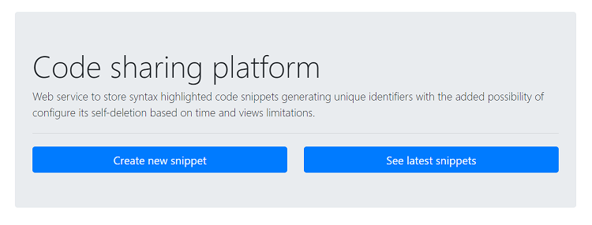
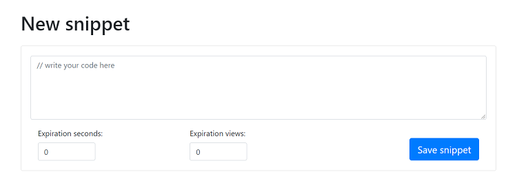
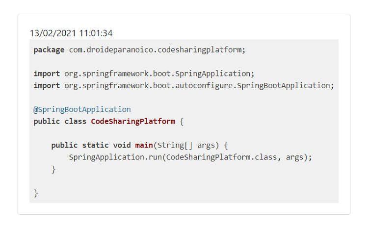
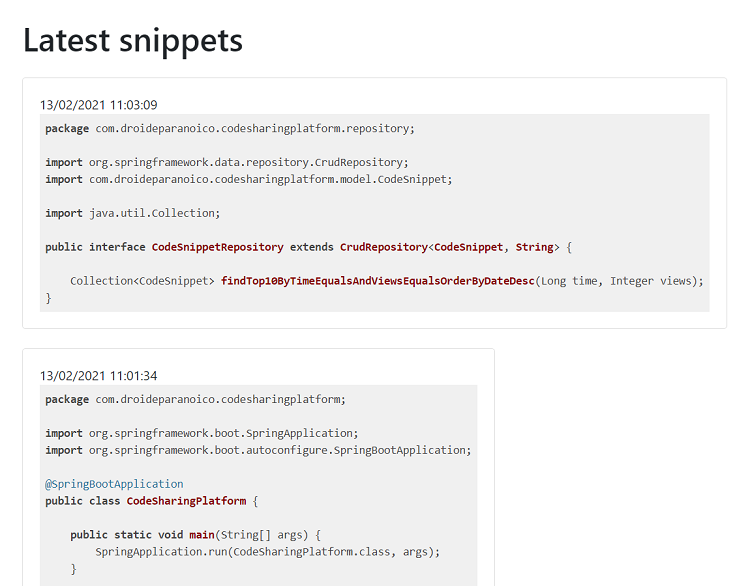
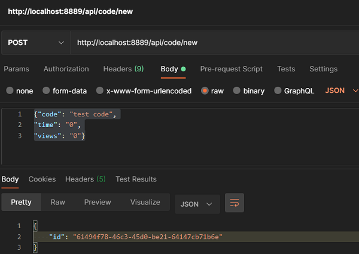
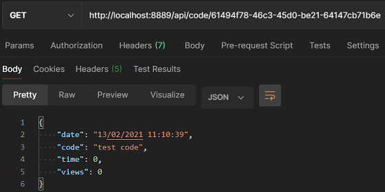
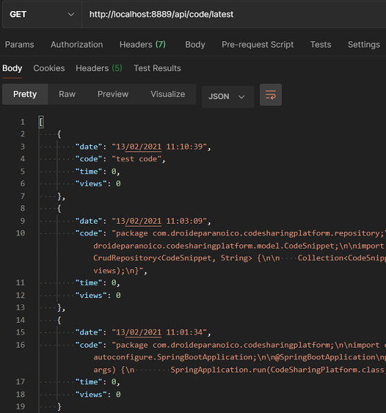

<h1>Code Sharing Platform</h1>

Web service to store syntax highlighted code snippets generating unique identifiers with the added possibility of configure its self-deletion based on time and views limitations.  

There are two possible interfaces: API and web. The API interface returns data as `JSON`, while the web interface uses `HTML`, `JS`, and `CSS`.

<h2>Web interface endpoints</h2>

* `GET /` should return the starting page:
  
  
* `GET /code/new` should return the page that allows to save a new snippet:
  
  
* `GET /code/UUID` should return the page with associated code snippet:
  
  
* `GET /code/latest` should return the page with 10 most recently uploaded unrestricted code snippets:
  
  
<h2>API interface endpoints</h2>
  
* `GET /api/code/new` should take a JSON object with a field `code` and two other fields:
  
  &nbsp;&nbsp;&nbsp;&nbsp;1. `time` field containing the time (in seconds) during which the snippet is accessible.
  
  &nbsp;&nbsp;&nbsp;&nbsp;2. `views` field containing a number of views allowed for this snippet.
  
  And return JSON with a single field id:
  
  
* `GET /api/code/UUID` should return a JSON object with associated code snippet:
  
  
* `GET /api/code/latest` should return a JSON array the 10 most recently uploaded unrestricted code snippets:
  
  